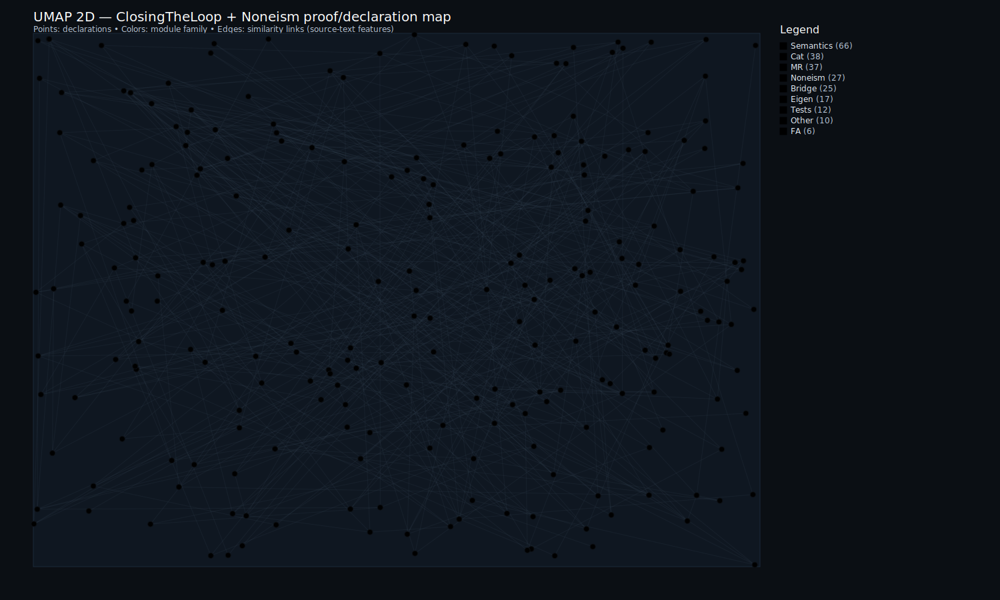
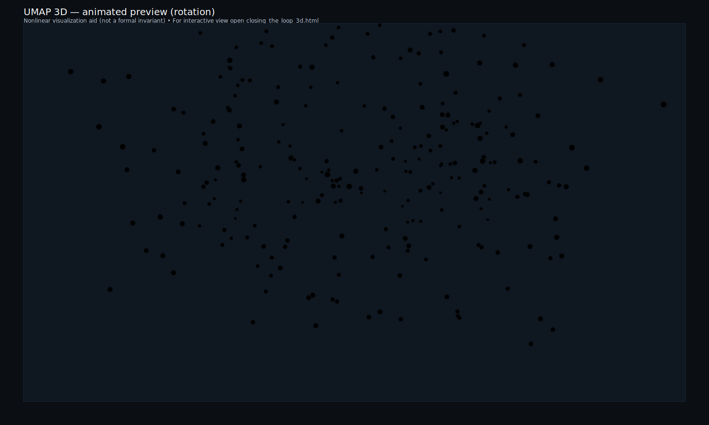
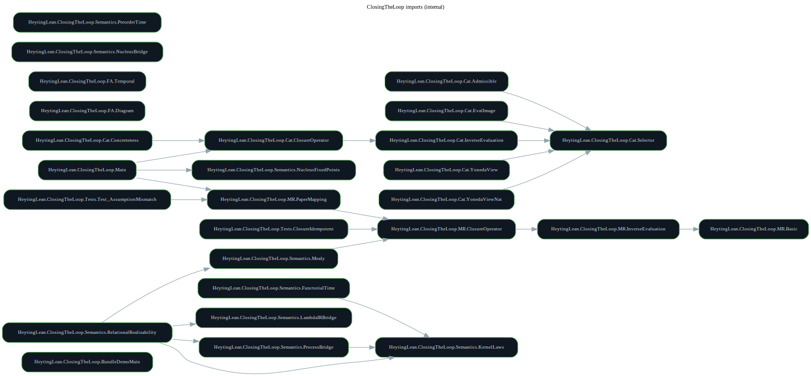
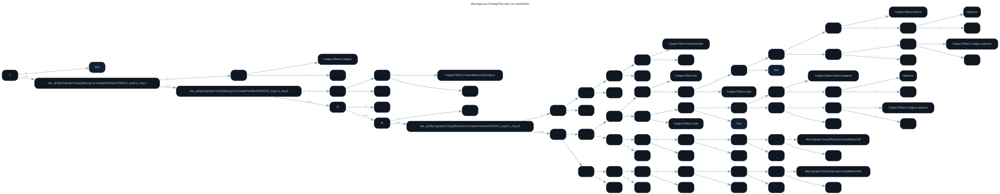
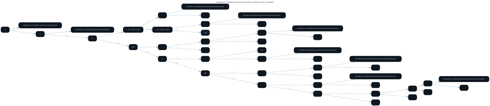

<sub><strong>Our tech stack is ontological:</strong><br>
<strong>Hardware — Physics</strong><br>
<strong>Software — Mathematics</strong><br><br>
<strong>Our engineering workflow is simple:</strong> discover, build, grow, learn & teach</sub>

---

<sub>
<strong>Notice of Proprietary Information</strong><br>
This document outlines foundational concepts and methodologies developed during internal research and development at Apoth3osis. To protect our intellectual property and adhere to client confidentiality agreements, the code, architectural details, and performance metrics presented herein may be simplified, redacted, or presented for illustrative purposes only. This paper is intended to share our conceptual approach and does not represent the full complexity, scope, or performance of our production-level systems. The complete implementation and its derivatives remain proprietary.
</sub>

---

# semantic-closure-lean


## Credo

> *"The genome doesn't specify the organism; it offers a set of pointers to regions in the space of all possible forms, relying on the laws of physics and computation to do the heavy lifting."*
> — **Michael Levin**

Our company operates as a lens for cognitive pointers: identifying established theoretical work and translating it into computationally parsable structures. By turning ideas into formal axioms, and axioms into verifiable code, we create the "Lego blocks" required to build complex systems with confidence.

### Acknowledgment

We humbly thank the collective intelligence of humanity for providing the technology and culture we cherish. We do our best to properly reference the authors of the works utilized herein, though we may occasionally fall short. Our formalization acts as a reciprocal validation—confirming the structural integrity of their original insights while securing the foundation upon which we build. In truth, all creative work is derivative; we stand on the shoulders of those who came before, and our contributions are simply the next link in an unbroken chain of human ingenuity.

---

## Closing the Loop: Semantic Closure in Lean 4

**Lean 4 Mechanization of Semantic Closure for Open-Ended Evolution**

*For: López-Díaz, Gershenson, and collaborators*
*Paper: Closing the loop: how semantic closure enables open-ended evolution (J. R. Soc. Interface 22: 20250784)*

---

## How This Work Helps Your Research

### What We've Built

We took the mathematics from your paper—the (M,R) systems, the evaluation maps, the beta inverse, the closure conditions—and translated it into Lean 4, a language where a computer can check every logical step.

When Lean accepts a proof, it means the reasoning is correct. Not "probably correct" or "peer-reviewed correct"—mathematically, mechanically, unambiguously correct.

We then went further: the same proofs can be compiled down to ordinary C code that runs on any computer.

### Why This Matters

Your paper makes a bold claim: semantic closure is the key to understanding how life bootstraps itself, how evolution becomes open-ended, how meaning emerges from mechanism.

That's a hard claim to test. The mathematics is subtle. The diagrams are intricate. Reviewers and readers have to trust that everything fits together.

**Now they don't have to trust. They can verify.**

Every equation in your paper that we've formalized can be checked by running a single command. The computer either accepts it or rejects it. There's no ambiguity, no hidden assumptions, no hand-waving.

---

## What You Can Do With This

### 1. Strengthen Your Claims

When you say "the closure operator is idempotent" (your equation 2.5 composed with itself), that's now a machine-checked theorem called `closeSelector.idem`. Anyone can inspect it. Anyone can verify it. It becomes a permanent, reusable fact.

### 2. Catch Subtle Errors Early

Formalizing mathematics forces precision. The process of translation itself often reveals hidden assumptions or edge cases. If something doesn't quite work, Lean tells you—before reviewers do.

### 3. Run Your Proofs as Programs

This is the unusual part. We don't just verify the math; we compile it to executable C code.

Why does that matter? Because your (M,R) systems describe processes. Metabolism, repair, replication—these are dynamics. With executable code, you can:

- Simulate semantic closure emerging in artificial chemistries
- Sweep parameters across (F,A) configurations
- Embed verified kernels into larger models (Python, Julia, MATLAB)
- Test hypotheses computationally, not just symbolically

The C output is simple and readable. It can be called from any programming language. It runs on laptops, servers, or embedded hardware.

### 4. Build a Foundation for Future Work

Every theorem we've proved becomes a building block. Future papers can import these definitions and extend them. You don't have to re-establish the basics each time.

Want to add a new model of computation? Connect it to our `ReachSystem` framework. Want to explore a different categorical setting? Extend the `Cat/` modules. The infrastructure is designed for growth.

---

## Quick Verification

```bash
cd RESEARCHER_BUNDLE
./scripts/verify_closing_the_loop.sh
```

That's it. One command. It builds everything from scratch, checks for proof holes, audits the axioms, compiles the executable, and produces the C output.

**If it passes, the mathematics is verified.**

### Noneism extension (Eigencomputable crossings)

This repository also contains an additional mechanized layer that refines how nonconstructive choices are interpreted by explicitly tying them to stabilizing dynamics (via the `Eigen` packaging and `@[eigencomputable ...]` tags).

```bash
cd RESEARCHER_BUNDLE
./scripts/verify_noneism.sh
```

Docs:

- `RESEARCHER_BUNDLE/docs/11_Eigencomputable_Framework.md`
- `RESEARCHER_BUNDLE/docs/12_Categorical_Foundations.md`

---

## Proof Visualizations

### Interactive Proof/Declaration Maps

We provide interactive visualizations showing the structure and dependencies of all proofs:

<table>
<tr>
<td align="center" width="50%">
<strong>2D Proof Map</strong><br/>
<em>Pan, zoom, search declarations</em><br/>
<a href="https://abraxas1010.github.io/semantic-closure-lean/closing_the_loop_2d.html">
  
</a><br/>
<a href="https://abraxas1010.github.io/semantic-closure-lean/closing_the_loop_2d.html">closing_the_loop_2d.html</a> (GitHub Pages)
</td>
<td align="center" width="50%">
<strong>3D Proof Map</strong><br/>
<em>Rotate, zoom, explore clusters</em><br/>
<a href="https://abraxas1010.github.io/semantic-closure-lean/closing_the_loop_3d.html">
  
</a><br/>
<a href="https://abraxas1010.github.io/semantic-closure-lean/closing_the_loop_3d.html">closing_the_loop_3d.html</a> (GitHub Pages)
</td>
</tr>
</table>

**UMAP note (interpretation + limitations):**
- UMAP is a non-linear projection of high-dimensional feature vectors into 2D/3D; here the features are derived from Lean source text statistics and structural signals.
- Only *local neighborhoods* are intended to be meaningful; global distances/cluster geometry are not proof-theoretic invariants.
- Treat these maps as navigational aids; the formal guarantee is always the Lean kernel check.
- GitHub README pages block embedded iframes/WebGL; the README shows lightweight SVG previews, while the full interactive 3D viewer is on GitHub Pages.

**Interactive Viewers:**
- [**2D Viewer**](https://abraxas1010.github.io/semantic-closure-lean/closing_the_loop_2d.html) — Pan/zoom, hover for names, click for details
- [**3D Viewer**](https://abraxas1010.github.io/semantic-closure-lean/closing_the_loop_3d.html) — Drag to rotate, wheel to zoom, explore the proof space
- [**Visualization Index**](https://abraxas1010.github.io/semantic-closure-lean/index.html) — Full listing of all available visualizations
- [**Computation Demo (WASM)**](https://abraxas1010.github.io/semantic-closure-lean/compute_add1.html) — Runs an extracted C artifact in-browser (no backend), explicitly linked to a Lean theorem node

**Proof → Artifact mapping (clickable in the viewers):**
- In the 2D/3D viewers, selecting a node can show an **Artifacts** panel with links to proof DAGs and extracted artifacts.
- Example: click `HeytingLean.ClosingTheLoop.Semantics.LambdaIRBridge.eval_beta` to open the WASM demo and the corresponding `LambdaIR`/`MiniC`/`C` files.

### Module Structure

The import graph shows how the Lean modules are organized:



*Internal module dependencies within `HeytingLean.ClosingTheLoop`. The tiered structure reflects the mathematical layering: Set/Type foundations → Categorical abstractions → Semantic interpretations.*

### Key Proof DAGs

These diagrams show the dependency structure of core theorems:

**Closure Operator Idempotence** (`closeSelector.idem`):


*The central theorem that the closure operator is idempotent: `close(close Φ) = close Φ`. This corresponds to your paper's claim that semantic closure stabilizes.*

**Curry Naturality** (`curryNatIso`):



*Establishes that currying is natural in the categorical setting—the Yoneda-style foundation for representability of selectors.*

**Relational Realizability** (`realizable_invariant_of_simulation`):



*Invariants transport along simulations—connecting the dynamics track to the computation track.*

---

## What We Formalized (The Highlights)

| Your Concept | What It Means | Our Contribution |
|--------------|---------------|------------------|
| Equation 2.3 (injectivity) | "If two selectors agree at b, they're the same selector" | Machine-checked theorem |
| Equation 2.5 (closure loop) | The beta-Phi-f composition | Executable operator with idempotence proof |
| The S(G) restriction | Not all selectors are biologically admissible | Explicit "Admissible" subtype |
| (F,A) temporal extension | Different processes run at different time scales | Functorial time semantics |
| Semantic closure = fixed point | The central insight of your paper | Unified via Heyting nucleus |

---

## What We Deliberately Did Not Do

We didn't formalize the probabilistic/DBN semantics from your Figures 1-2. That would require a substantial probability theory library and is better treated as future work.

We also made no attempt to prove your biological interpretations correct—that's empirical science, not mathematics. What we can verify is that *given your assumptions, the conclusions follow*.

---

## The Assumption Ladder (Honesty Built In)

Your paper carefully distinguishes between:

- **Injectivity at b** (weak—just says solutions are unique)
- **Beta defined on the image** (medium—constructive, no magic)
- **Beta as a global inverse** (strong—requires classical choice)

We preserve this distinction in code. When a theorem uses classical logic, Lean tells us. When it doesn't, we know the proof is fully constructive. You can see exactly what assumptions each result depends on.

---

# Technical Implementation

## The Core Correspondence

Your paper's central diagram (eq. 2.5):

```
      f              Phi_f            beta_b
  A ─────> B ─────────────> H(A,B) ─────────────> H(B, H(A,B))
```

becomes semantically closed when the loop `beta_b . Phi_f . f` stabilizes.

## Paper-to-Lean Mapping

```
┌───────────────────────────────────────────────────────────────────────┐
│  YOUR PAPER                                                           │
│                                                                       │
│  Eq (2.1): A -> B -> H(A,B)             Metabolism + Repair           │
│  Eq (2.3): Phi_1(b)=Phi_2(b) => Phi_1=Phi_2    Injectivity condition  │
│  Eq (2.4): beta_b : H(A,B) -> H(B,H(A,B))      Inverse evaluation     │
│  Eq (2.5): beta_b . Phi_f . f                  Closure loop           │
│                                                                       │
└───────────────────────────────────┬───────────────────────────────────┘
                                    │
                                    v
┌───────────────────────────────────────────────────────────────────────┐
│  LEAN TIER 1: Set/Type Level                                          │
│                                                                       │
│  InjectiveEvalAt           <-- Your eq (2.3)                          │
│  RightInverseAt            <-- Your beta_b (as chosen data)           │
│  EvalImage.betaOnImage     <-- beta restricted to image (choice-free) │
│  closeSelector             <-- The closure operator beta_b . (.)(b)   │
│  closeSelector.idem        <-- Idempotence theorem                    │
│  IsClosed                  <-- Fixed-point predicate                  │
│                                                                       │
└───────────────────────────────────┬───────────────────────────────────┘
                                    │
                                    v
┌───────────────────────────────────────────────────────────────────────┐
│  LEAN TIER 2: Categorical Level                                       │
│                                                                       │
│  Exponentials + evaluation morphisms                                  │
│  "Concrete category" as explicit assumption (faithful U : C => Type)  │
│  Yoneda route: presheaves C => (C^op => Type), fully faithful         │
│  Inverse-on-image guardrail (no global beta from mere mono)           │
│  Admissible subobject encoding (your S(G) restriction)                │
│                                                                       │
└───────────────────────────────────┬───────────────────────────────────┘
                                    │
                                    v
┌───────────────────────────────────────────────────────────────────────┐
│  LEAN TIER 3: Noneism / Eigencomputable (optional extension)          │
│                                                                       │
│  Eigen.StabilizingDynamics      <-- Selector dynamics on metabolisms  │
│  Eigen.determined_by_dynamics   <-- Unique stable selector per (M,R)  │
│  Bridge.beta_right_inverse      <-- beta grounded via eigencomputing  │
│  @[eigencomputable ...]         <-- Tagged definitions (auditable)    │
│                                                                       │
└───────────────────────────────────────────────────────────────────────┘
```

## Detailed Paper-Lean Correspondence

| Paper | Mathematical Content | Lean Declaration | File |
|-------|---------------------|------------------|------|
| Eq (2.1) | A -> B -> H(A,B) | `Metabolism`, `Selector` | `MR/Basic.lean` |
| Eq (2.2) | Evaluation eval_{Y,X} | `evalAt` | `MR/InverseEvaluation.lean` |
| Eq (2.3) | Injectivity at b | `InjectiveEvalAt` | `MR/InverseEvaluation.lean` |
| Eq (2.4) | beta_b inverse | `RightInverseAt`, `EvalImage` | `MR/InverseEvaluation.lean` |
| Eq (2.5) | Closure loop | `closeSelector` | `MR/ClosureOperator.lean` |
| — | Idempotence | `closeSelector.idem` | `MR/ClosureOperator.lean` |
| — | Fixed points | `IsClosed` | `MR/ClosureOperator.lean` |
| Eq (2.6) | Dashed diagram | Categorical mirror | `Cat/Selector.lean` |
| Section 2.1 | S(G) admissibility | `Admissible` | `Cat/Admissible.lean` |
| Section 3 | (F,A) systems | `FADiagram` | `FA/Diagram.lean` |
| Eq (3.3-5) | Time scales | `PreorderTime`, `FunctorialTime` | `Semantics/*.lean` |
| Fig 1-2 | DBN semantics | Not mechanized | Documented out-of-scope |
| *Noneism* | Selector dynamics | `StabilizingDynamics` | `Noneism/Eigen/Core.lean` |
| *Noneism* | Unique stable point | `determined_by_dynamics` | `Noneism/Eigen/Core.lean` |
| *Noneism* | β right inverse | `beta_right_inverse` | `Noneism/Bridge/*.lean` |

## The Assumption Ladder

Your paper notes the tension between assuming beta globally vs. on the image. We formalize this explicitly:

```
WEAKEST ──────────────────────────────────────────────────────── STRONGEST

InjectiveEvalAt(b)         EvalImage.betaOnImage        RightInverseAt(b, beta)
        │                          │                            │
        v                          v                            v
"Phi_1(b)=Phi_2(b) => Phi_1=Phi_2" "beta on range only"        "beta is chosen inverse"
(uniqueness; no inverse)           (choice-free; honest)       (uses Classical.choice)
```

## The Two-Track Architecture

Your paper unifies computational and dynamical perspectives. Our development mirrors this:

```
    COMPUTATION TRACK                      DYNAMICS TRACK
    =================                      ==============

    Lean (ClosingTheLoop proofs)           (M,R)/(F,A) categorical diagrams
           │                                      │
           │ proofs erase;                        │ time-indexing /
           │ executable remains                   │ reachability
           v                                      v
    Lambda IR semantics                    ReachSystem / Kernel / Nucleus
           │                                      │
           │ certified compilation                │ simulation relations
           │ fragments                            │
           v                                      v
    MiniC AST -> C AST -> cc binary        Process / Mealy / Functorial-time
           │                                      │
           v                                      v
    Curry-Howard                           Relational Realizability
    (proofs-as-programs)                   (invariants transport)
           │                                      │
           └──────────────────┬───────────────────┘
                              │
                              v
              ╔═══════════════════════════════════════════╗
              ║         HEYTING NUCLEUS Omega_R           ║
              ║                                           ║
              ║  Fixed points R(x) = x <-> Semantic       ║
              ║  closure (dynamics: halting/periodic)     ║
              ╚═══════════════════════════════════════════╝
```

## Repository Structure

```
semantic-closure-lean/
├── README.md                    # This file
├── images/                      # Static visualizations
│   └── proof_graph_visualization.png
├── 01_Lean_Map.md               # Module and declaration index
├── 02_Proof_Index.md            # Where each proof lives
├── 03_Reproducibility.md        # Build and verification commands
├── 04_Dependencies.md           # Lean/mathlib version pins
├── 05_Researcher_Agenda_Report.md  # Status and gaps
├── 06_Paper_Math_Outline.md     # Paper-to-Lean mapping
├── 07_ClosingTheLoop_Lean_Contribution.odt  # Researcher-facing writeup
├── Blueprint/
│   ├── README.md
│   ├── closing_the_loop_appendix.tex
│   └── closing_the_loop_appendix_standalone.tex
└── RESEARCHER_BUNDLE/           # <-- VERIFICATION BUNDLE
    ├── HeytingLean/
    │   ├── ClosingTheLoop/
    │   │   ├── MR/              # Set/Type level
    │   │   │   ├── Basic.lean
    │   │   │   ├── InverseEvaluation.lean
    │   │   │   └── ClosureOperator.lean
    │   │   ├── Cat/             # Categorical mirror
    │   │   │   ├── Selector.lean
    │   │   │   ├── InverseEvaluation.lean
    │   │   │   ├── EvalImage.lean
    │   │   │   ├── Concreteness.lean
    │   │   │   └── Admissible.lean
    │   │   ├── FA/              # (F,A) systems
    │   │   │   ├── Diagram.lean
    │   │   │   └── Temporal.lean
    │   │   └── Semantics/       # Computation + dynamics hooks
    │   │       ├── NucleusFixedPoints.lean
    │   │       ├── PreorderTime.lean
    │   │       ├── FunctorialTime.lean
    │   │       ├── LambdaIRBridge.lean
    │   │       ├── ProcessBridge.lean
    │   │       ├── Mealy.lean
    │   │       └── RelationalRealizability.lean
    │   └── Noneism/             # Eigencomputable extension
    │       ├── Eigen/           # Core stabilizing dynamics
    │       │   └── Core.lean
    │       ├── Bridge/          # Connection to ClosingTheLoop
    │       │   └── SelectorDynamics.lean
    │       └── Core.lean        # Main entry point
    ├── scripts/
    │   ├── verify_closing_the_loop.sh
    │   ├── verify_noneism.sh
    │   └── regenerate_visuals.py
    ├── reports/
    ├── docs/
    │   ├── 11_Eigencomputable_Framework.md
    │   └── 12_Categorical_Foundations.md
    ├── artifacts/
    │   └── visuals/             # Interactive proof visualizations
    │       ├── index.html       # Visualization hub
    │       ├── closing_the_loop_2d.html   # 2D interactive viewer
    │       ├── closing_the_loop_3d.html   # 3D interactive viewer
    │       ├── imports/         # Module import graphs (SVG)
    │       └── proof_dags/      # Proof dependency graphs (SVG)
    ├── lean-toolchain           # Pinned: leanprover/lean4:v4.24.0
    └── lakefile.lean
```

## Implementation Status

| Component | Status | Location |
|-----------|--------|----------|
| MR scaffold (Set/Type) | Complete | `ClosingTheLoop/MR/*` |
| Cat scaffold (categorical) | Complete | `ClosingTheLoop/Cat/*` |
| FA diagram + temporal | Complete | `ClosingTheLoop/FA/*` |
| Nucleus fixed-point wrapper | Complete | `Semantics/NucleusFixedPoints.lean` |
| `closeSelector.idem` | Complete | `MR/ClosureOperator.lean` |
| beta from surjectivity | Complete (Classical.choice) | `MR/InverseEvaluation.lean` |
| beta on image (choice-free) | Complete | `MR/InverseEvaluation.lean`, `Cat/EvalImage.lean` |
| Preorder-time semantics | Complete | `Semantics/PreorderTime.lean` |
| Functorial-time semantics | Complete | `Semantics/FunctorialTime.lean` |
| Lambda IR -> C pipeline | Complete | `LambdaIR/`, `MiniC/`, `C/*` |
| Relational realizability | Complete | `Semantics/RelationalRealizability.lean` |
| DBN/probabilistic semantics | Out of scope | Documented in `06_Paper_Math_Outline.md` |
| **Noneism extension** | Complete | `Noneism/*` |
| Eigencomputable dynamics | Complete | `Noneism/Eigen/*` |
| Bridge to ClosingTheLoop | Complete | `Noneism/Bridge/*` |

---

## Noneism Extension: Eigencomputable Crossings

*This section documents an optional extension that refines how nonconstructive choices are interpreted. It does not modify the core ClosingTheLoop formalization.*

### Motivation

The core formalization uses `Classical.choice` to construct beta_b (equation 2.4). While mathematically sound, this leaves the beta construction as an oracle—correct in principle but opaque in practice.

The Noneism extension provides an alternative: **eigencomputable** beta, where the inverse is grounded in stabilizing dynamics rather than pure choice.

### The Eigencomputable Hierarchy

```
COMPUTABLE ───────────────────────────────────────────────────── ARBITRARY
     │                           │                                  │
     v                           v                                  v
  Decidable               Eigencomputable                   Classical.choice
  termination             (stable fixed point)              (no witness)
```

An **eigencomputable** function is one whose output can be characterized as a stable fixed point of some dynamics—even if we cannot compute it directly, we know *what* it is via its stability property.

### Key Results

| Theorem | Statement | Significance |
|---------|-----------|--------------|
| `determined_by_dynamics` | Stable points are unique per metabolism | The dynamics determine the selector |
| `beta_right_inverse` | β is a right inverse (eq 2.4) | Grounded constructively via eigencomputing |
| `beta_stable` | β outputs are dynamically stable | Bridge to the dynamics track |

### Usage

```bash
cd RESEARCHER_BUNDLE
./scripts/verify_noneism.sh
```

For detailed documentation:
- `RESEARCHER_BUNDLE/docs/11_Eigencomputable_Framework.md`
- `RESEARCHER_BUNDLE/docs/12_Categorical_Foundations.md`

---

## The Bigger Picture

You wrote: *"We lack a general model to explain how semantic closure originated."*

We think the Heyting nucleus provides that model. It's a mathematical structure where:

- **Fixed points** (things unchanged by the closure operator) correspond to semantically closed configurations
- The **algebraic properties** (inflationary, idempotent, meet-preserving) capture the essential features of self-reference
- **Computation and dynamics** unify through the same interface

This isn't a proof that your theory is correct about biology. That's an empirical question. But it is a proof that your theory is **coherent**—that the pieces fit together, that the logic holds, that the framework can bear the weight of future extensions.

---

## Prerequisites

- `elan` installed (Lean toolchain manager)
- C compiler (`cc`), linker toolchain
- `bash`, `python3`
- Optional: `jq`, `ldd`

Lean version is pinned by `lean-toolchain` (see `04_Dependencies.md`).

---

## An Invitation

We built this to support your research, not to compete with it. The code is open. The proofs are inspectable. The infrastructure is extensible.

If you find errors, we want to know. If you want to extend it, we can help. If you want to cite it, we'd be honored.

The goal is to make the mathematics of semantic closure as solid as the mathematics of calculus—something future researchers can build on without having to re-verify the foundations.

---

*Lean toolchain: leanprover/lean4:v4.24.0 | Mathlib: v4.24.0*
